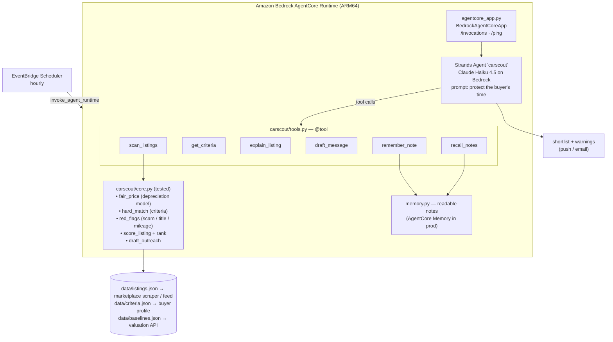

# CarScout — Architecture

## Overview

A **single Strands agent** over a deterministic scoring core. The agent never
estimates a car's value; it triages the core's output and writes the brief.

## Components

| File | Responsibility |
|---|---|
| `agentcore_app.py` | AgentCore Runtime contract. `{prompt, actor_id}` → `{result}`. |
| `carscout/agent.py` | System prompt: lead with the shortlist, name the scams, don't list the misses. |
| `carscout/tools.py` | Six `@tool` wrappers — no logic. |
| `carscout/core.py` | **Correctness layer.** Fair price, criteria, red flags, ranking, outreach draft. |
| `carscout/memory.py` | Buyer decisions as one-line facts, namespaced by `actor_id`. |
| `tests/test_core.py` | 12 deterministic tests. |
| `run_demo.py` | Offline ranking dump. |

## How it meets the three hackathon requirements

| Requirement | Where |
|---|---|
| **Built with Strands Agents SDK** | `carscout/agent.py` — `strands.Agent` + `@tool`. |
| **Routine/repetitive background work** | The "check the marketplace, price everything, spot the scams" loop, run on a cron, output only when something is worth pursuing. |
| **Deployable on Amazon Bedrock AgentCore** | `agentcore_app.py` + `DEPLOY.md`. |

## Scoring model (in `core.py`)

- `fair_price` = model baseline − (age × per-year depreciation) − (miles × per-1k depreciation).
- `score` starts at 60 for a criteria match, adjusts ±25 for price vs fair,
  +6 private seller, +4 stale (negotiable), +3 per nice-to-have, −15 per red flag.
- A **CRITICAL** flag (bad title, scam-level underpricing) caps score at 5 and
  forces `verdict: skip` regardless of everything else.

## Model

`us.anthropic.claude-haiku-4-5-20251001-v1:0` by default (`MODEL_ID` to override), temp 0.2.
